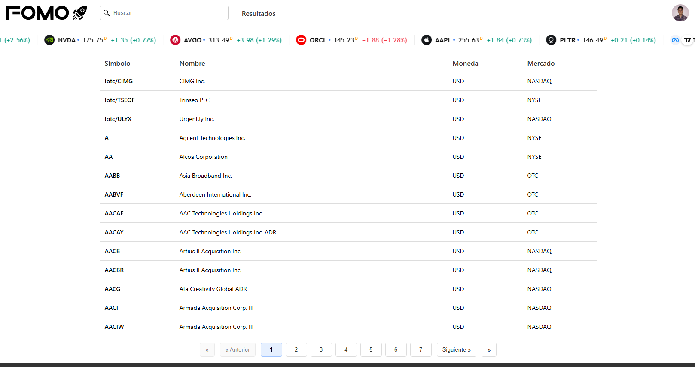
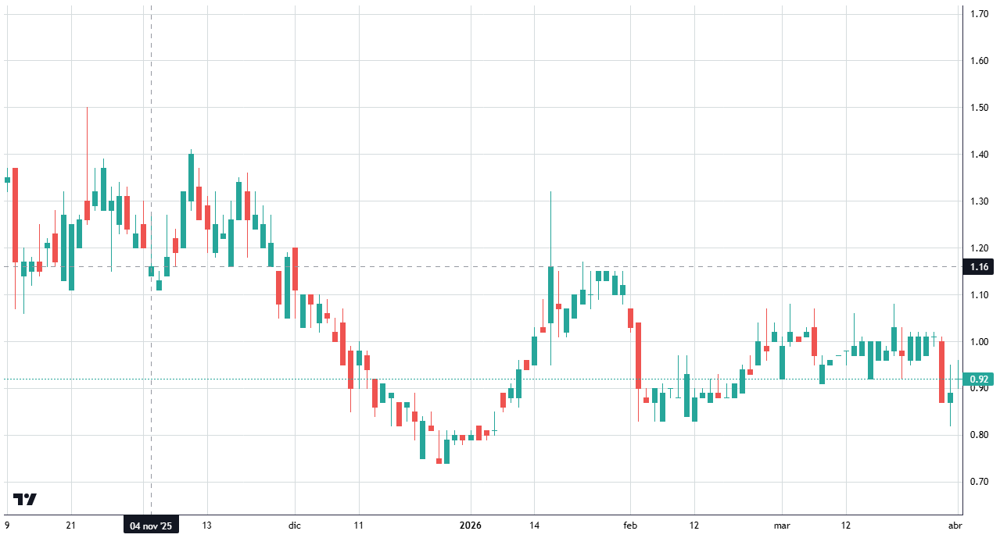
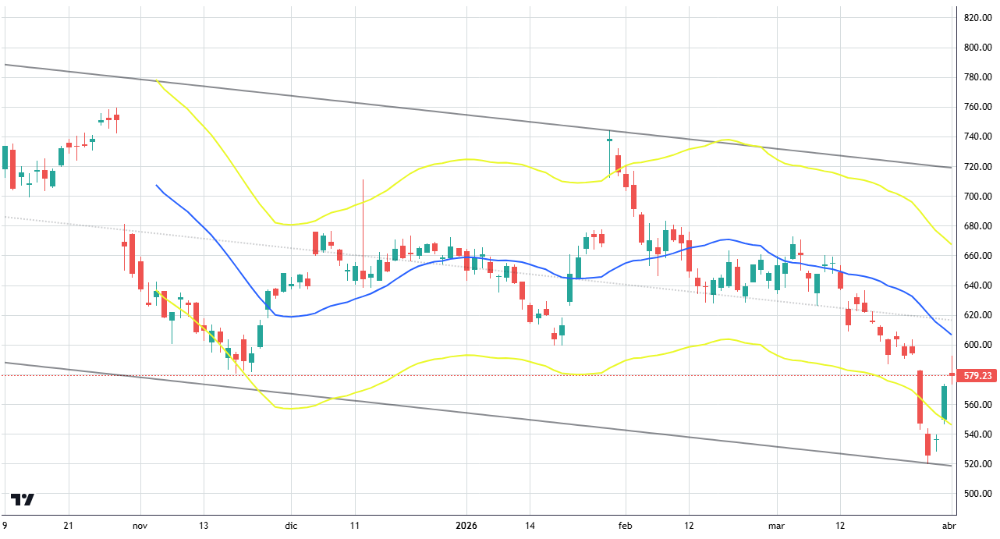
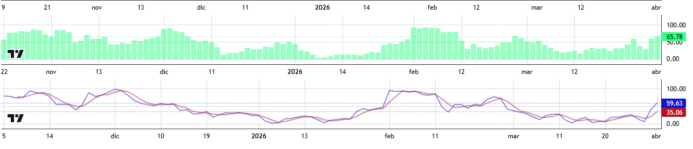
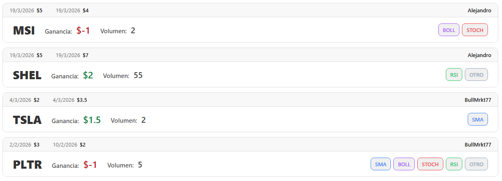
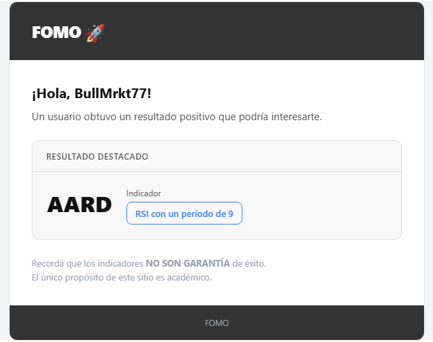

# 📈 Stock Analysis Platform

A web-based financial analysis platform focused on U.S. stock markets (NASDAQ, NYSE), combining **technical analysis tools** with a **collaborative social experience**.

---

## 🧠 Overview

This platform enables users to:

* 📊 Visualize stock price data through interactive charts
* 📉 Apply multiple technical indicators on the same chart
* 🔔 Configure alerts for the indicators
* 👤 Create and manage personal accounts
* 🤝 Share trading results with other users
* 📢 Receive email notifications when other users achieve positive outcomes

The goal is to deliver a solution that is both **intuitive for beginners** and **useful for more advanced users**, reducing the complexity of technical analysis.

---

## 🧩 Key Differentiator

Unlike traditional analysis tools, this platform introduces a **social layer** that allows users to:

* Share strategies and results
* Learn from other users' successful trades
* Identify patterns through community activity

---

## 🏗️ Architecture

| Layer    | Technology                                             |
| -------- | ------------------------------------------------------ |
| Frontend | React 19 (Vite)                                        |
| Backend  | .NET 8 (Web API)                                       |
| Database | SQL Server *(easily replaceable via Entity Framework)* |

---

## 🔗 Repositories

* 🟦 Frontend: https://github.com/FOMO-financial-app/frontend
* 🟩 Backend: https://github.com/FOMO-financial-app/backend

---

## 📸 Visual Overview

### 🔍 Search & Discovery

Quickly search and explore stocks across NASDAQ and NYSE markets.

### 📊 Interactive Charting

Analyze stock price movements with an interactive candlestick chart.

### 📈 Technical Indicators

Apply multiple indicators such as SMA and Bollinger Bands on the same chart.

You can also use specific indicators, such as RSI or Stochastic Oscillator.

### 🤝 Social Trading Insights

View and share trading results with other users in a collaborative environment.

### 🔔 Smart Alerts

Get notified when specific conditions are met or when other users achieve positive results.

---

## ⚙️ Core Features

* ✔️ Stock search (NASDAQ / NYSE)
* ✔️ Interactive charting
* ✔️ Technical indicators (e.g., RSI, SMA, Bollinger Bands, etc.)
* ✔️ Alert system
* ✔️ User authentication
* ✔️ Social sharing of trading results

---

## 🎯 Project Goal

To build a financial analysis platform that:

* Simplifies technical analysis for everyday users
* Supports data-driven decision making
* Encourages knowledge sharing through social interaction
* Follows scalable and maintainable architectural practices

---

## 🌐 Language

> The application UI is currently in Spanish, while the codebase and documentation are written in English.

---

## 👨‍💻 Author

Developed by Alejandro Goró as part of a professional portfolio project.

---

## 🚀 Project Status

🟢 Completed (portfolio project)

---
